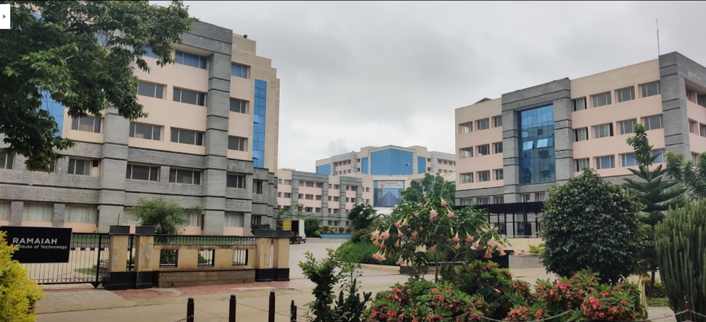

## Education
---
#### Master of Science, Computer Science 
[Tandon School of Engineering of New York University](https://engineering.nyu.edu/)  

CGPA: 3.6
---
#### Bachelor of Engineering, Computer Science and Engineering

[Ramaiah Institute of Technology, Bengaluru](https://www.msrit.edu/)  

GPA: 9/10

