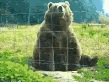

<html style="background-image: url('assets/bin/seaweed_tile.jpg')">

<body >

Hello World, 

 
 

<a href="/video_search.html">Go to Video Search</a>
 
 

</body>

 

<!--

<object data="../assets/bin/ANS_Resume_DS_ML.pdf" width="1000" height="1000" type='application/pdf'></object>

 -->

</html>

#### I am a Computer Science Engineer currently pursuing Master's Degree at New York University. 
